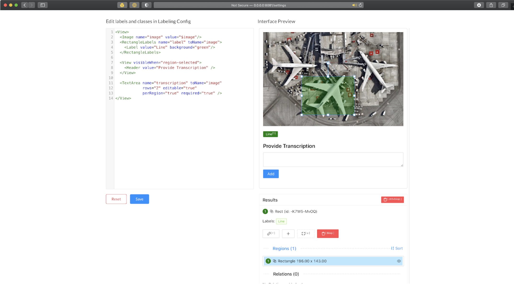

# Data Labeling
open-source tool인 label studio를 이용하여 handwriting 샘플들을 annotating

## Data
Handwritten paragraphs were collected in the FSDL March 2019 class.

The resulting PDF was stored at https://fsdl-public-assets.s3-us-west-2.amazonaws.com/fsdl_handwriting_20190302.pdf

알 pdf 이용하여 pdf -> jpg 이미지 추출. (일괄 편집 이용.)

## Annotation

Label Studio(https://labelstud.io)

pip 이나 Docker를 이용한 설치. (사이트 메인에 나와있음.)

```sh
# Install the package
pip install -U label-studio
# Launch it!
label-studio
```

다운받은 이미지 몇개를 label studio에 import한다.
그 다음 이미지 내 문장 line(위치)와 text content(내용)을 입력할 수 있도록 label interface를 정의한다. 아래 사이트와 이미지를 참고한다.

(https://labelstud.io/playground/)
 
annotating을 완료하면 json 파일로 export 할 수 있다.


